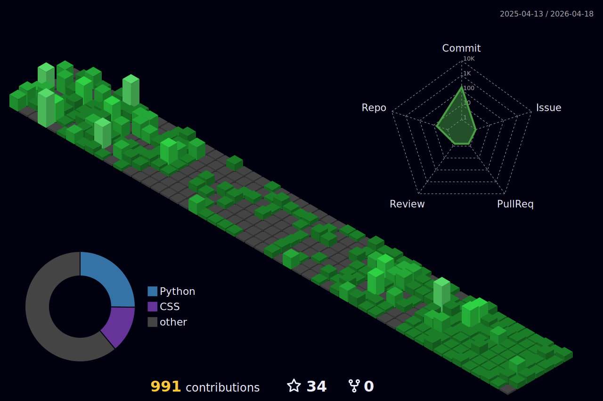

<h1 align="center">👋 Hey there, I'm Fakhrillokhon Lutfillokhonov</h1>
<h3 align="center">AI & Backend Engineer | Django • FastAPI • Telegram Bots • PostgreSQL</h3>

  

<!-- Social -->

  
  
  

---

## 🧠 About Me

- 🔭 Focused on **AI-powered backend systems**
- 🌱 Currently working with **Django, FastAPI, NLP, ML, PostgreSQL, Go**
- 🤖 Building **Telegram bots**, **interview systems**, and **automation pipelines**
- 💬 Ask me about **Backend Architecture, AI Integration, APIs**
- ⚡ *It’s boring if you don’t think outside the box*

---

## 🏆 GitHub Achievements

  

---

## 🛠 Tech Stack

### 👨‍💻 Languages

  
  
  

### ⚙️ Frameworks & Tools

  
  
  
  
  

### 🗄 Databases & Data

  
  

---

## 📊 GitHub Analytics

  

  

  

---

## 📈 3D Contribution Graph

  

---

## 🐍 Contribution Activity

  

---

## 📌 Featured Work
👉 Explore my projects:  
🔗 **https://github.com/Fakhrillo?tab=repositories**

---

  <strong>🚀 Building scalable backends & intelligent systems</strong>

